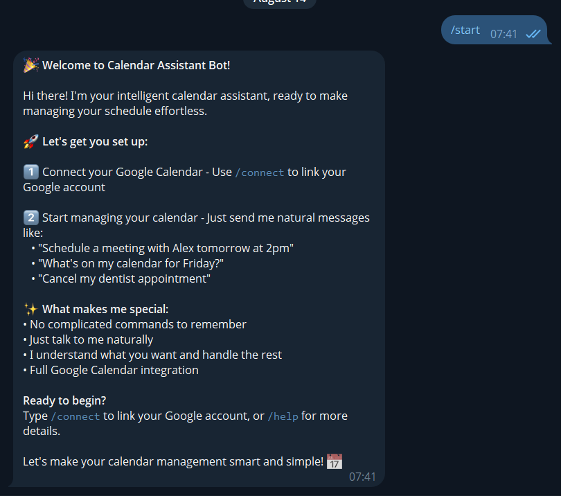
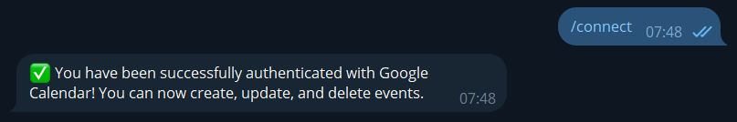
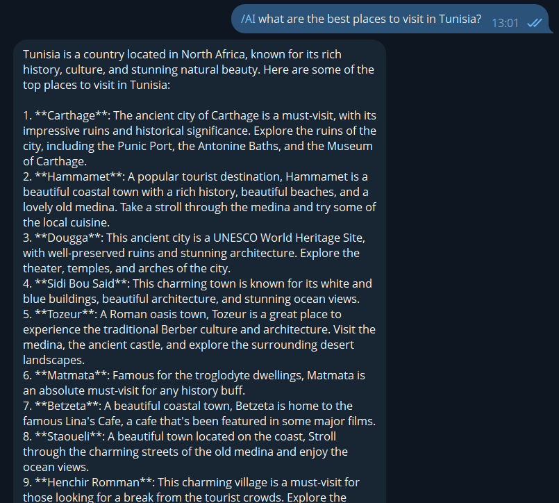
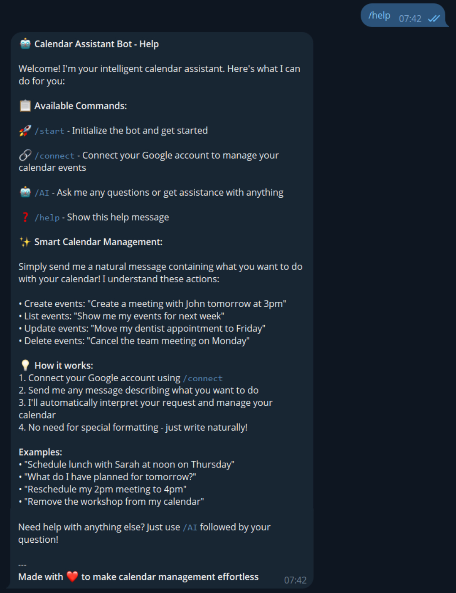
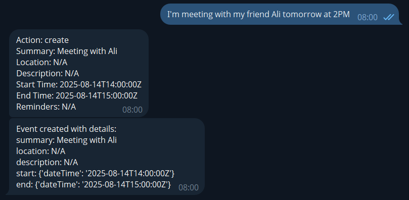
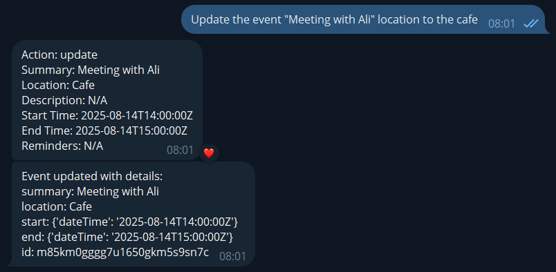
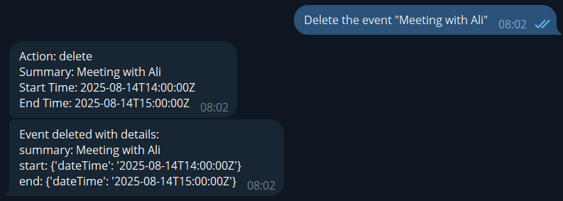

# 🤖 Intelligent Calendar Assistant Bot

<div align="center">


</div>

A smart Telegram bot that lets you manage your Google Calendar through natural language conversations. No more remembering complex commands - just tell the bot what you want to do with your calendar in plain English!

## ✨ Features

- **Natural Language Processing**: Interact with your calendar using everyday language
- **Google Calendar Integration**: Full access to create, read, update, and delete calendar events
- **Secure OAuth2 Authentication**: Safe and secure Google account connection
- **AI-Powered Understanding**: Intelligent interpretation of user requests using advanced AI
- **Simple Commands**: Easy-to-use bot commands for quick access

## 🚀 Commands

### `/start`
Initialize the bot and get started. This command welcomes new users and provides an overview of the bot's capabilities.



### `/connect` 
Connect your Google account via OAuth2. This command initiates the secure authentication flow to link your Google Calendar with the bot. You'll be redirected to Google's authorization page to grant calendar permissions.



### `/AI`
Ask the AI assistant any questions. Use this command followed by your question to get help with anything beyond calendar management. The AI can assist with general queries, explanations, and guidance.



### `/help`
Display detailed help information about all available commands and features. Shows examples of natural language interactions and explains how to use the bot effectively.



## 📅 Smart Calendar Operations

The bot's core functionality revolves around intelligent calendar management through natural language processing. Here's what you can accomplish:

### 📝 Create Events
Transform natural language into calendar events instantly. Simply describe when and what you want to schedule, and the AI will parse the details to create a properly formatted calendar event.

**Examples:**
- "Schedule a meeting with the marketing team tomorrow at 2 PM"
- "Book dentist appointment next Friday at 10:30 AM"
- "Create a reminder for mom's birthday on December 25th"



### ✏️ Update Events
Modify existing calendar events using conversational language. The AI understands context and can identify which event you want to change based on your description.

**Examples:**
- "Move my dentist appointment to next Wednesday at 3 PM"
- "Change the marketing meeting to 4 PM instead"
- "Reschedule lunch with Sarah to tomorrow"



### 🗑️ Delete Events
Remove events from your calendar by simply describing what you want to cancel. The bot will identify and confirm the deletion of the specified event.

**Examples:**
- "Cancel my dentist appointment on Friday"
- "Remove the team standup meeting"
- "Delete the workshop from my calendar next week"



### 📋 List Events
View your upcoming events and schedule with natural queries. Ask about specific time periods or general availability.

**Examples:**
- "What do I have scheduled for tomorrow?"
- "Show me my events for next week"
- "What's on my calendar this afternoon?"

## 💬 Natural Language Examples

Instead of complex commands, just chat naturally:

- "Schedule a meeting with John tomorrow at 3pm"
- "Show me my events for next week"
- "Move my dentist appointment to Friday at 2pm"
- "Cancel the team standup on Monday"
- "What do I have planned for this afternoon?"

## 🛠️ Tech Stack

-  **Python 3.8+** - Core programming language
-  **python-telegram-bot** - Telegram Bot API wrapper
-  **OpenRouter API** - AI language model integration for natural language processing
-  **Google Calendar API** - Calendar event management
-  **Google OAuth2 API** - Secure authentication and authorization

## 📋 Prerequisites

Before running this bot, you'll need:

1. **Telegram Bot Token** - Create a bot via [@BotFather](https://t.me/botfather)
2. **Google Cloud Project** - Set up Google Calendar and OAuth2 APIs
3. **OpenRouter API Key** - Register at [OpenRouter](https://openrouter.ai/)

## 🔧 Installation

1. Clone the repository:
```bash
git clone https://github.com/yourusername/telegram-calendar-bot.git
cd telegram-calendar-bot
```

2. Install required dependencies:
```bash
pip install -r requirements.txt
```

3. Set up environment variables:
```bash
cp .env.example .env
```

4. Configure your `.env` file:
```env
TELEGRAM_BOT_TOKEN=your_telegram_bot_token
OPENROUTER_API_KEY=your_openrouter_api_key
GOOGLE_CLIENT_ID=your_google_client_id
GOOGLE_CLIENT_SECRET=your_google_client_secret
```

## ⚙️ Google API Setup

1. Go to [Google Cloud Console](https://console.cloud.google.com/)
2. Create a new project or select an existing one
3. Enable the Google Calendar API
4. Create OAuth2 credentials (Web application type)
5. Add authorized redirect URIs for your bot
6. Download the client configuration

## 🏃‍♂️ Running the Bot

```bash
python main.py
```

## 🤝 How It Works

1. **User Authentication**: Users connect their Google account using OAuth2
2. **Message Processing**: The bot receives natural language messages
3. **AI Interpretation**: OpenRouter AI processes the message to understand intent and extract event details
4. **Calendar Integration**: The bot performs the requested action on Google Calendar
5. **Response**: User receives confirmation of the completed action

## 📝 Example Workflow

```
User: "Schedule lunch with Sarah tomorrow at noon"
Bot: ✅ Created event: Lunch with Sarah
📅 December 15, 2024 at 12:00 PM
```

## 🔒 Security & Privacy

- All Google account connections use secure OAuth2 authentication
- No passwords are stored or handled by the bot
- Users can revoke access at any time through Google account settings
- API keys and sensitive data are stored securely via environment variables

## 🤖 AI Integration

The bot uses OpenRouter's AI models to:
- Parse natural language requests
- Extract event details (title, date, time, participants)
- Determine the intended action (create, update, delete, list)
- Handle complex scheduling scenarios

## 🐛 Contributing

1. Fork the repository
2. Create a feature branch (`git checkout -b feature/amazing-feature`)
3. Commit your changes (`git commit -m 'Add amazing feature'`)
4. Push to the branch (`git push origin feature/amazing-feature`)
5. Open a Pull Request

## 📄 License

This project is licensed under the MIT License - see the [LICENSE](LICENSE) file for details.

## 🙏 Acknowledgments

- [python-telegram-bot](https://github.com/python-telegram-bot/python-telegram-bot) - Excellent Telegram Bot API wrapper
- [OpenRouter](https://openrouter.ai/) - AI model access and routing
- [Google Calendar API](https://developers.google.com/calendar) - Calendar integration

## 📞 Support

If you encounter any issues or have questions, please [open an issue](https://github.com/yourusername/telegram-calendar-bot/issues) on GitHub.

---

Made with ❤️ to make calendar management effortless
